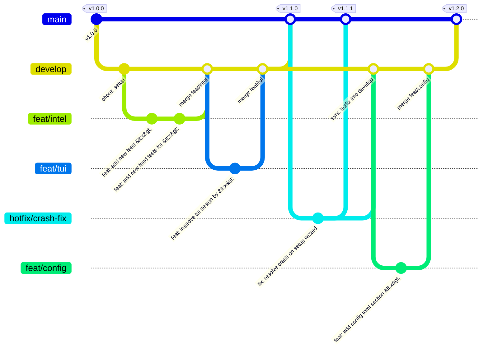

# Contributing to PKG-Defender

Thank you for your interest in contributing to PKG-Defender. Every contribution — whether it's a bug report, feature suggestion, documentation improvement, or code change — helps make the tool better for everyone.

This document explains how to contribute effectively. Please read it before opening issues or submitting pull requests.

---

## Table of Contents

- [Code of Conduct](#code-of-conduct)
- [Ways to Contribute](#ways-to-contribute)
- [Reporting Bugs](#reporting-bugs)
- [Suggesting Features](#suggesting-features)
- [Your First Contribution](#your-first-contribution)
- [Development Setup](#development-setup)
- [Project Structure](#project-structure)
- [Development Workflow](#development-workflow)
- [Code Standards](#code-standards)
- [Config Generation](#config-generation)
- [Man Page Workflow](#man-page-workflow)
- [Testing](#testing)
- [Commit Message Format](#commit-message-format)
- [Pull Request Process](#pull-request-process)
- [Release Process](#release-process)
- [Homebrew Tap Maintenance](#homebrew-tap-maintenance)
- [Questions?](#questions)

---

## Code of Conduct

This project follows a [Code of Conduct](./CODE_OF_CONDUCT.md). By participating, you agree to uphold it.
Please report unacceptable behavior to the maintainer via the contact details in that document.

---

## Ways to Contribute

You don't have to write code to contribute meaningfully to PKG-Defender:

- 🐛 **Report bugs** using the [bug report template](https://github.com/divisionseven/pkg-defender/issues/new?template=bug_report.yml)
- 🚀 **Suggest features** using the [feature request template](https://github.com/divisionseven/pkg-defender/issues/new?template=feature_request.yml)
- 📖 **Improve documentation** — fix typos, clarify explanations, add examples
- 🧪 **Write tests** — especially for edge cases or untested code paths
- 🔍 **Triage issues** — help reproduce bugs, confirm behavior, or suggest labels
- 💬 **Answer questions** in [Discussions](https://github.com/divisionseven/pkg-defender/discussions)
- 📣 **Spread the word** — write about PKG-Defender, give a talk, or recommend it

---

## Reporting Bugs

Before reporting a bug:

1. Search [existing issues](https://github.com/divisionseven/pkg-defender/issues) to avoid duplicates
2. Make sure you're using the [latest release](https://github.com/divisionseven/pkg-defender/releases)
3. Check the [documentation](https://github.com/divisionseven/pkg-defender/blob/main/docs/index.md) — the behavior may be intentional

**For security vulnerabilities**, do NOT open a public issue. See [SECURITY.md](./SECURITY.md).

Use the [bug report template](https://github.com/divisionseven/pkg-defender/issues/new?template=bug_report.yml) to submit your report.

---

## Suggesting Features

Use the [feature request template](https://github.com/divisionseven/pkg-defender/issues/new?template=feature_request.yml).

Good feature requests include:
- A clear description of the **problem** you're trying to solve
- Your **proposed solution** and what it would look like in practice
- Why existing behavior or workarounds are insufficient

If you're unsure whether a feature is a good fit, start a [Discussion](https://github.com/divisionseven/pkg-defender/discussions) first.

---

## Your First Contribution

New to open source or to this project? Start with issues labelled [`good first issue`](https://github.com/divisionseven/pkg-defender/labels/good%20first%20issue) or [`help wanted`](https://github.com/divisionseven/pkg-defender/labels/help%20wanted).

**Before starting work on anything significant**, please comment on the issue to let the maintainer know you're working on it. This prevents duplicate effort. For new features without an existing issue, open one first and wait for a response before investing time in implementation.

---

## Development Setup

### Prerequisites

- Python 3.11 or later
- [pipx](https://pipx.pypa.io/) (recommended for installing `pkgd` itself during development)
- Git

### 1. Fork and Clone

```bash
# Fork the repo on GitHub, then:
git clone https://github.com/<your-username>/pkg-defender.git
cd pkg-defender
```

### 2. Install with uv (recommended)

```bash
uv sync --dev
```

This installs PKG-Defender in editable mode along with all development dependencies (pytest, ruff, mypy, pre-commit, python-dateutil). Requires [uv](https://docs.astral.sh/uv/getting-started/installation/) to be installed.

### 3. Install Pre-Commit Hooks (Required)

After setting up your environment, install the pre-commit hooks:

```bash
pre-commit install
```

This configures Git to automatically run linting (`ruff check --fix`), formatting (`ruff format`), type checking (`mypy`), and other quality checks before every commit. Hooks that fail will block the commit until fixed.

<details>
<summary>Alternative: pip-based setup</summary>

```bash
python -m venv .venv
source .venv/bin/activate      # macOS / Linux
.venv\Scripts\activate         # Windows (PowerShell)
pip install -e ".[test,lint]"
pre-commit install
```

</details>

### 4. Verify the Setup

```bash
pkgd --version
pytest --tb=short
ruff check .
mypy src/pkg_defender --strict
```

All commands should pass without errors on a fresh clone of `main`.

For full verification (including tests and build), run the manual check script:

```bash
./scripts/pre-commit-check.sh
```

---

## Project Structure

```
pkg-defender/
├── src/
│   └── pkg_defender/
│       ├── __init__.py
│       ├── __pkgd_entry__.py   # Binary entrypoint
│       ├── _http.py            # Shared HTTP client
│       ├── audit/              # Cooldown engine, bypass service, reporter
│       ├── cli/                # Click command definitions
│       ├── config/             # Configuration system (dataclasses)
│       ├── core/               # Threat query pipeline (auditor, checker, parsers, scorer)
│       ├── daemon/             # Background daemon
│       ├── db/                 # Threat database schema (SQLite)
│       ├── display.py          # Terminal output formatting
│       ├── exceptions.py       # Custom exception types
│       ├── intel/              # Threat intelligence feed adapters
│       ├── logging_filter.py   # Log filtering utilities
│       ├── models/             # Data models
│       ├── py.typed            # PEP 561 marker
│       ├── registry/           # 30+ package manager adapters
│       ├── shells/             # Shell hook generation
│       └── version.py          # Package version
├── tests/
│   ├── __init__.py
│   ├── README.md               # Test documentation
│   ├── conftest.py
│   ├── fixtures/               # Lock files, repodata fixtures
│   ├── integration/            # End-to-end integration tests
│   ├── scripts/                # Test helper scripts
│   └── unit/                   # Unit tests (mirrors src/)
├── docs/                       # Diátaxis documentation
│   ├── index.md
│   ├── assets/
│   ├── examples/
│   ├── explanation/
│   ├── guides/
│   ├── man/
│   ├── reference/
│   └── tutorials/
├── .github/                    # CI/CD and contribution workflows
├── github-action/              # GitHub Action (source of truth)
├── homebrew-tap/               # Homebrew tap formula (source of truth)
├── scripts/                    # Development and CI helper scripts
├── pyproject.toml
├── CHANGELOG.md
├── CONTRIBUTING.md
├── LICENSE
├── Makefile
├── README.md
├── ruff.toml
└── SECURITY.md
```

---

## Development Workflow

### Branching Strategy

This project follows a `main` → `develop` → `feat/*` workflow, with a separate `hotfix/*` path
for urgent fixes. `main` is protected — all changes land via pull request, never direct push.

#### Branches

| Branch            | Purpose                                                              | Branches off | Merges into              |
| ----------------- | -------------------------------------------------------------------- | ------------ | ------------------------ |
| `main`            | Stable, released code. Never commit directly.                        | —            | —                        |
| `develop`         | Integration branch for work-in-progress. Base your branches on this. | `main`       | `main`                   |
| `fix/<name>`      | Bug fixes                                                            | `develop`    | `develop`                |
| `feat/<name>`     | New features                                                         | `develop`    | `develop`                |
| `docs/<name>`     | Documentation changes                                                | `develop`    | `develop`                |
| `chore/<name>`    | Maintenance, dependencies, CI                                        | `develop`    | `develop`                |
| `hotfix/<name>`   | Urgent production patches/fixes (ADMIN ONLY)                         | `develop`    | `main` **and** `develop` |
| `security/<name>` | Security fixes                                                       | `develop`    | `develop`                |

#### Feature work

1. Branch from `develop`:
   ```bash
   git checkout develop
   git pull
   git checkout -b feat/short-description
   ```
2. Commit your work on the feature branch.
3. Open a PR into `develop`.
4. Once merged, delete the feature branch.

#### Releasing

When `develop` is stable and ready to ship:

1. Open a PR from `develop` into `main`.
2. Once merged, wait for [CI](.github/workflows/ci.yml) to complete and push a signed / annotated tag:
   ```bash
   git tag -s v1.0.0 -m "Release 1.0.0"
   git push origin v1.0.0
   ```
3. Once the tag is pushed, the [release pipeline](.github/workflows/release.yml) triggers automatically and publishes a release.

#### Hotfixes (ADMIN ONLY)

*The following is listed for transparency and policy documentation - NOT as instructions for outside contributors*

For urgent fixes that can't wait for the next scheduled release:

1. Branch from `main`:
   ```bash
   git checkout main
   git pull
   git checkout -b hotfix/short-description
   ```
2. Commit the fix.
3. Open a PR from `hotfix/*` into `main`. Once merged, follow steps #2-#3 from the Releasing section above to push a patch release.
4. **Also** open a PR from `hotfix/*` into `develop`, so the fix isn't lost the next time `develop` merges into `main`.

#### Branching Diagram



#### Rules

- Never commit directly to `main` — always via PR (preferably do not commit directly on `develop` unless urgent).
- `feat/*`, `fix/*`, `docs/*`, `security/*`, `chore/*` branches only merge into `develop`.
- `hotfix/*` branches merge into both `main` and `develop` (ADMIN ONLY).

```bash
# Create a feature branch from develop
git checkout develop
git pull origin develop
git checkout -b feat/my-feature-name
```

### Keeping Your Fork in Sync

```bash
git remote add upstream https://github.com/divisionseven/pkg-defender.git
git fetch upstream
git rebase upstream/develop
```

---

## Code Standards

PKG-Defender enforces code quality with automated tools. All checks must pass before a PR can be merged.

### Style and Formatting — Ruff

```bash
ruff check .                  # Lint
ruff check . --fix            # Lint and auto-fix
ruff format .                 # Format
ruff format --check .         # Check formatting without modifying
```

### Type Checking — mypy (Strict Mode)

All public functions and methods must have complete type annotations.

```bash
mypy src/pkg_defender --strict
```

### General Guidelines

- Write clear, self-documenting code. Prefer explicit over implicit.
- Keep functions small and focused on a single responsibility.
- Add docstrings to all public modules, classes, and functions.
- Avoid adding new dependencies without prior discussion in an issue.
- When modifying CLI output, consider the `--json` flag and ensure JSON output remains stable.
- Exit codes must follow the conventions defined in `src/pkg_defender/cli/_exit_codes.py`.

---

## Config Generation

The TOML configuration system uses [tomlkit](https://github.com/sdispater/tomlkit) for
comment-preserving TOML generation and editing.

### Architecture

| Component                     | Location                              | Responsibility                                                                                                                    |
| ----------------------------- | ------------------------------------- | --------------------------------------------------------------------------------------------------------------------------------- |
| `_generate_config_template()` | `src/pkg_defender/cli/common.py`      | Builds a fully-commented TOML document. Comments are hardcoded here — this is the single source for TOML formatting and comments. |
| `_write_config_toml()`        | `src/pkg_defender/cli/common.py`      | Atomic TOML string writer. Validates with `tomllib.loads()`, writes via temp file + `os.replace()`.                               |
| `PKGDConfig` dataclass        | `src/pkg_defender/config/settings.py` | Single source of truth for default VALUES (not comments).                                                                         |
| `tomlkit.parse()`             | Used in config commands               | Parse existing TOML while preserving comments for round-trip editing.                                                             |

### Workflows

- **`pkgd setup --init`**: Calls `_generate_config_template()` → `tomlkit.dumps()` → `_write_config_toml()`. Produces a beautiful, commented TOML file.
- **`pkgd setup` (re-run)**: Calls `_generate_config_template()` → parses existing config with `tomlkit.parse()` → overlays existing values onto template → `tomlkit.dumps()` → `_write_config_toml()`. Preserves user values while refreshing structure/comments.
- **`pkgd config set <key> <value>`**: Parses existing config with `tomlkit.parse()` → navigates to key → sets value → `tomlkit.dumps()` → `_write_config_toml()`. Preserves ALL user-added comments.
- **`pkgd config set-secret <key>`**: Same as `config set` but prompts for hidden input.

### What to Update When

| Change                          | Action                                                                                                                                                                                               |
| ------------------------------- | ---------------------------------------------------------------------------------------------------------------------------------------------------------------------------------------------------- |
| Change a default value          | Update the dataclass field in `PKGDConfig` / section config in `settings.py` ONLY. The template reads values at runtime.                                                                             |
| Add a new config field          | Add dataclass field in `settings.py` + add field with comments to `_generate_config_template()` in `common.py`.                                                                                      |
| Change TOML comments/formatting | Update `_generate_config_template()` ONLY.                                                                                                                                                           |
| Sample file consistency         | `docs/examples/config/pkgd.toml` should be kept approximately in sync with the template output. Not enforced by CI, but maintainers should update it when the template format changes significantly. |

## Man Page Workflow

The man page is maintained as a **markdown source of truth** that is converted to troff at build time. Both files are committed to the repository so contributors without `pandoc` installed can still ship changes.

### Source of Truth

- **Markdown source** (human-edited): `docs/man/pkgd.1.md`
- **Generated troff** (committed, regenerated by `make man`): `docs/man/pkgd.1`

The generated `docs/man/pkgd.1` is what ships in the wheel at `share/man/man1/pkgd.1` — see `pyproject.toml:98-99` for the hatchling `wheel` target's `force-include` mapping.

### Tooling

| Tool     | Purpose                     | Required?                                                                                                                       |
| -------- | --------------------------- | ------------------------------------------------------------------------------------------------------------------------------- |
| `pandoc` | Markdown → troff conversion | **Required** for regenerating `docs/man/pkgd.1`. Install via `brew install pandoc` (macOS) or `apt-get install pandoc` (Linux). |
| `mandoc` | Man page syntax linter      | **Required in CI**, optional locally. Install via `brew install mandoc` (macOS) or `apt-get install mandoc` (Linux).            |

### Regenerating the Man Page

After editing `docs/man/pkgd.1.md`, regenerate the troff file:

```bash
make man
```

This runs:

1. `pandoc --standalone --to=man docs/man/pkgd.1.md -o docs/man/pkgd.1`
2. `mandoc -Tlint docs/man/pkgd.1` — fails the build if the generated man page has syntax errors

The `mandoc -Tlint` step is **also** run in CI (see `.github/workflows/ci.yml`, the `lint` job) so a broken man page will block PRs.

### CI Verification

The CI pipeline (`.github/workflows/ci.yml`) performs two man-page checks:

1. **Lint** (`lint` job, after `Type check (mypy)`) — runs `mandoc -Tlint docs/man/pkgd.1`. Fails the build on any man-page syntax error.
2. **Wheel packaging** (`e2e-gate` job, after the blocking pipeline test) — builds the wheel and asserts the man page is in `zipfile.ZipFile.namelist()`. Catches the failure mode where `pyproject.toml` is misconfigured and the man page silently fails to ship.

### When to Regenerate

You **must** regenerate `docs/man/pkgd.1` (by running `make man` and committing the result) whenever any of the following change:

- A command is added, removed, or renamed
- An option, argument, or env var is added, removed, or has its default changed
- An exit code is added, removed, or has its semantics changed
- A subcommand (e.g., `logs follow`, `db snapshot`) is added or has its options changed
- A new package manager is added to `UNIFIED_MANAGER_REGISTRY` or `MANAGER_NAMES`
- A new feed is added to `intel sync` or any feed's enable/disable default changes

The CI lint and wheel-packaging checks will fail if the generated file is stale relative to the markdown source — but **not** the other way around. Run `make man` before opening a PR.

### How to Add a New Command to the Man Page

1. Open `docs/man/pkgd.1.md` in your editor.
2. Add a new `**command_name**` line under the appropriate `##` section (`## Common Commands`, `## Management Commands`, `## Other Commands`, or `## Package Manager Commands`).
3. For subcommands, use the indented definition list syntax (term on one line, `:` indented on the next).
4. Run `make man` to regenerate the troff file.
5. Commit **both** `docs/man/pkgd.1.md` and `docs/man/pkgd.1` in the same commit.

Example — adding a new subcommand `pkgd foo bar`:

```markdown
**foo bar** [**\--baz** *NAME*]
:   Description of the bar subcommand.
```

If your new command introduces a new env var, exit code, or global option, also update the relevant section (`# ENVIRONMENT`, `# EXIT STATUS`, `# GLOBAL OPTIONS`).

## Testing

PKG-Defender uses `pytest`. All changes must include appropriate test coverage.

```bash
# Run all tests
pytest

# Run with coverage report
pytest --cov=src/pkg_defender --cov-report=term-missing

# Run a specific test file
pytest tests/unit/audit/test_cooldown.py

# Run tests matching a keyword
pytest -k "test_cooldown"
```

### Test Guidelines

- Unit tests go in `tests/unit/` — mock external dependencies (network, filesystem, registry).
- Integration tests go in `tests/integration/` — test real interactions where necessary.
- Use Click's `CliRunner` for testing CLI commands.
- Do not make real network requests in unit tests.
- Test both success paths and failure/edge cases.
- Aim for high coverage of the cooldown engine and feed ingestion logic, as these are security-critical.

#### Coverage Gate

The CI pipeline has two coverage gates:

1. **End-to-end blocking test** (`e2e-gate` job) — runs `tests/integration/test_smoke_e2e.py`
   on ubuntu-24.04 / Python 3.12. This gate catches functional regressions in the core
   threat-checking, cooldown, and blocking pipeline. It fails fast, before the full test matrix.

2. **Line-rate coverage threshold** (`--cov-fail-under=90`) — enforced across all 9 matrix
   entries. Prevents overall coverage drift. A commit that breaks threat checking will fail
   gate 1 even if gate 2 passes.

---

## Commit Message Format

PKG-Defender follows the [Conventional Commits](https://www.conventionalcommits.org/) specification.

```
<type>(<scope>): <short description>

[optional body]

[optional footer(s)]
```

### Types

| Type       | When to Use                                |
| ---------- | ------------------------------------------ |
| `feat`     | A new feature                              |
| `fix`      | A bug fix                                  |
| `docs`     | Documentation changes only                 |
| `style`    | Formatting, whitespace (no logic changes)  |
| `refactor` | Code restructuring (no functional changes) |
| `perf`     | Performance improvements                   |
| `test`     | Adding or updating tests                   |
| `build`    | Build system or dependency changes         |
| `ci`       | CI/CD configuration changes                |
| `chore`    | Maintenance, tooling, minor tasks          |
| `revert`   | Reverting a previous change                |

### Developer Certificate of Origin (DCO)

This project requires all contributors to certify that their contributions
comply with the [Developer Certificate of Origin (DCO) v1.1](https://developercertificate.org/).

By signing off your commits, you certify that you have the right to submit
the code under the project's license and that you understand the contribution
is made under the terms of the [Apache 2.0 License](./LICENSE).

**How to sign off:** Use `git commit -s` to automatically add a
`Signed-off-by` trailer to your commit message. The trailer should look like:

```
Signed-off-by: Your Name <your.email@example.com>
```

If you forget to sign off on a commit, you can amend it:

```bash
git commit --amend -s
```

The DCO check must pass for all commits in a pull request before it can be
merged. You can install the [DCO GitHub App](https://github.com/apps/dco)
on your repository to automate this check.

---

## Pull Request Process

### Submitting a Pull Request

1. **Fork** the repository and create a branch following the
   [branching strategy](#branching-strategy):
   - `feat/<name>` for new features
   - `fix/<name>` for bug fixes
   - `docs/<name>` for documentation changes
   - `chore/<name>` for maintenance, dependencies, CI
   - `security/<name>` for security fixes
2. **Target `develop`** for all branches except hotfixes (which target `main`).
3. **Write Conventional Commits** — every commit must follow the
   [format](#commit-message-format). The PR title must also follow this format.
4. **Update `CHANGELOG.md`** — add a brief entry under `[Unreleased]` describing
   your change.
5. **Open the PR** using the [PR template](https://github.com/divisionseven/pkg-defender/blob/main/.github/PULL_REQUEST_TEMPLATE.md).

### PR Requirements

Before a PR can be merged, **all** of the following must pass:

| Gate       | Command                                      | Description                    |
| ---------- | -------------------------------------------- | ------------------------------ |
| Lint       | `ruff check .`                               | Code style and error detection |
| Format     | `ruff format --check .`                      | Formatting consistency         |
| Type check | `mypy src/pkg_defender --strict`             | Type safety                    |
| Tests      | `pytest`                                     | All tests pass                 |
| Coverage   | `pytest --cov-fail-under=90`                 | 90% minimum line coverage      |
| E2E gate   | `pytest tests/integration/test_smoke_e2e.py` | Core pipeline smoke test       |
| Man page   | `mandoc -Tlint docs/man/pkgd.1`              | Man page syntax validity       |

#### Makefile

For common development tasks, you can use the Makefile:

| Command          | Description                        |
| ---------------- | ---------------------------------- |
| `make install`   | Install all dependencies           |
| `make lint`      | Check code style                   |
| `make typecheck` | Type checking                      |
| `make test`      | Run tests                          |
| `make check`     | Run lint, typecheck, and tests     |
| `make build`     | Build the package                  |
| `make clean`     | Clean build artifacts              |
| `make man`       | regenerate the man page troff file |

Run the pre-commit check script to verify all gates locally:

```bash
./scripts/pre-commit-check.sh
```

### Review Process

1. A maintainer will review your PR for correctness, test coverage, and
   adherence to the project's code standards.
2. **CI runs automatically** on every push — lint, type check, test matrix
   (9 entries), and e2e gate. All must pass before review.
3. **Dependency review** runs automatically on PRs to `main`/`develop` via
   `.github/workflows/dependency-review.yml`. It blocks PRs with CVSS ≥ 7.0
   vulnerabilities or GPL-3.0/AGPL-3.0 licenses.
4. Address review feedback by pushing additional commits (do not force-push
   during review — it breaks comment threads).
5. Once approved and all checks pass, a maintainer will merge the PR.

---

## Release Process

### How Releases Are Triggered

Releases are **fully automated** and triggered by pushing a version tag:

```bash
git tag v1.2.3
git push origin v1.2.3
```

For pre-releases:

```bash
git tag v1.2.3-beta.1
git push origin v1.2.3-beta.1
```

The tag **must** match the version in `pyproject.toml` and there **must** be a
corresponding entry in `CHANGELOG.md`. Both are validated before any build
artifacts are produced.

### Who Can Trigger Releases

Only repository maintainers with push access to tags can trigger a release.
The release workflow runs in the GitHub Actions environment and requires no
manual intervention beyond the tag push.

### What the CI/CD Pipeline Does

The release pipeline (`.github/workflows/release.yml`) runs 8 jobs in
dependency order:

```
 Trigger: Push a version tag — v1.2.3, v2.0.0-beta.1, etc.

 Pipeline (jobs run in dependency order):

   validate ───► ci ─┬┬─► build ───► prep-gh-release ─┬─► publish ──► smoke-test
                     ││                               │
                     ││                               └─► update-homebrew-tap
                     │└─► build-binaries                  (if stable release)
                     │    (linux, macOS, Windows)
                     │
                     └──► build-docker-image & run-trivy-scan
```

| Job                | What It Does                                                                                                                                                                                                             |
| ------------------ | ------------------------------------------------------------------------------------------------------------------------------------------------------------------------------------------------------------------------ |
| **validate**       | Verifies the tag version matches `pyproject.toml` and `CHANGELOG.md` has an entry for this version. Extracts changelog notes as a release artifact.                                                                      |
| **ci**             | Runs the full CI pipeline (lint, type check, 9-entry test matrix) as a reusable workflow call.                                                                                                                           |
| **build**          | Builds sdist + wheel (`python -m build`), generates a CycloneDX SBOM. All artifacts uploaded.                                                                                                                            |
| **build-docker**   | Builds the Docker image and runs Trivy vulnerability scanning against it. Fails the release if Trivy detects critical or high severity vulnerabilities.                                                                  |
| **build-binaries** | Builds standalone PyInstaller binaries for 4 platforms: `pkgd-linux-amd64`, `pkgd-darwin-amd64`, `pkgd-darwin-arm64`, `pkgd-windows-amd64.exe`. Each binary gets a SHA256 checksum.                                      |
| **github-release** | Assembles release body from changelog notes, creates a GitHub Release, and attaches all artifacts (sdist, wheel, binaries, SBOM).                                                                                        |
| **publish**        | Downloads the built sdist/wheel and publishes to PyPI using trusted publishing (`pypa/gh-action-pypi-publish`).                                                                                                          |
| **smoke-test**     | Installs the published package from PyPI into a fresh venv, verifies `pkgd --help` works, checks version matches the tag, and runs a threat-blocking smoke test. Retries with polling (up to 120s) for PyPI propagation. |

> **Trivy vulnerability scanning:** The `build-docker` job scans the built
> Docker image with Trivy before the release proceeds. `CRITICAL` and `HIGH`
> severity findings cause the workflow to fail, preventing vulnerable images
> from being published.

### Release Artifacts

Each release includes:

| Artifact                              | Description                          |
| ------------------------------------- | ------------------------------------ |
| `pkg_defender-X.Y.Z.tar.gz`           | Source distribution                  |
| `pkg_defender-X.Y.Z-py3-none-any.whl` | Python wheel                         |
| `pkgd-linux-amd64`                    | Linux binary (x86_64)                |
| `pkgd-darwin-amd64`                   | macOS binary (Intel)                 |
| `pkgd-darwin-arm64`                   | macOS binary (Apple Silicon)         |
| `pkgd-windows-amd64.exe`              | Windows binary (x86_64)              |
| `sbom.json`                           | CycloneDX Software Bill of Materials |
| `*.sha256`                            | SHA256 checksums for each binary     |

### Preparing a Release

Before pushing a tag:

1. Update `pyproject.toml` with the new version number.
2. Add a changelog entry in `CHANGELOG.md` under the version heading, following
   [Keep a Changelog](https://keepachangelog.com/en/1.1.0/) format.
3. Ensure all CI checks pass on `develop`.
4. Merge `develop` into `main` (or ensure the tag is on a commit that has passed
   CI).
5. Push the version tag.

---

## Homebrew Tap Maintenance

### Overview

pkg-defender is distributed via Homebrew through a dedicated tap repository:
[divisionseven/homebrew-pkg-defender](https://github.com/divisionseven/homebrew-pkg-defender).

The formula at `Formula/pkg-defender.rb` is **auto-generated** as the final step of
the release pipeline. Every time a stable version tag is pushed, the
`update-homebrew-tap` job in `.github/workflows/release.yml`:

1. Clones the tap repository
2. Downloads the SHA256 checksums from the GitHub Release and cross-verifies them
   against the actual binaries
3. Replaces the version number, download URLs, and SHA256 checksums in the formula
   using `sed`
4. Validates the updated formula with `brew audit`, `brew style`, and `brew test`
5. Creates a pull request in the tap repository
6. Enables auto-merge so the PR merges as soon as the tap's CI passes

The formula is **never manually edited** for version updates — the pipeline handles
everything. Manual edits are only needed for structural changes (new platform blocks,
updated `desc`, updated `homepage`, etc.).

> **Pre-releases are skipped:** The `update-homebrew-tap` job only runs for stable
> releases (`v1.2.3`), not pre-releases (`v1.2.3-beta.1`). Homebrew users expect
> stable versions only.

### Release Pipeline Flow

The tap update is job 9 of 9 in the release pipeline. It runs after the GitHub
Release is created (`github-release`) and depends on `build-binaries` (for SHA256
checksums).

```
 Release pipeline (main repo)          Tap repo (divisionseven/homebrew-pkg-defender)
 ────────────────────────────────────────────────────────────────────────────────────
 build-binaries ───► github-release ──► update-homebrew-tap
                                         │
                                         ├── 1. Clone tap repo
                                         ├── 2. Compute SHA256s from release
                                         ├── 3. Verify SHA256s against binaries
                                         ├── 4. sed-replace version/URLs/SHA256s
                                         ├── 5. Verify sed replacements
                                         ├── 6. Validate: brew audit --new --formula
                                         ├── 7. Validate: brew style --formula
                                         ├── 8. Install: brew install pkg-defender
                                         ├── 9. Test:    brew test pkg-defender
                                         ├── 10. Close stale tap PRs (if any)
                                         ├── 11. Create new PR
                                         └── 12. Enable auto-merge
                                                       │
                                                       ▼
                                                  tests.yml runs
                                               (style → audit → install → test)
                                                       │
                                                       ▼
                                                  PR auto-merges
```

#### Detailed step description:

| Step                       | What happens                                                                                                                                                                                                                               | Why                                                                                |
| -------------------------- | ------------------------------------------------------------------------------------------------------------------------------------------------------------------------------------------------------------------------------------------ | ---------------------------------------------------------------------------------- |
| **1. Clone**               | `git clone` the tap repo using `HOMEBREW_TAP_PAT` (a fine-grained PAT with `Contents: write` + `Pull requests: write` on the tap repo)                                                                                                     | We need write access to push the update branch and create a PR                     |
| **2. Compute SHA256**      | Download `.sha256` checksum files from the GitHub Release for `pkgd-darwin-arm64`, `pkgd-darwin-amd64`, and `pkgd-linux-amd64`                                                                                                             | These are the three platform binaries Homebrew needs to validate                   |
| **3. Cross-verify**        | For each platform: if `.sha256` was found, also download the binary and run `sha256sum -c` to ensure the checksum matches the actual binary                                                                                                | Catches corrupted or tampered checksum files before they enter the formula         |
| **4. sed-replace**         | Three sequential `sed` commands update the formula: (a) version string, (b) all download URLs (to point to the new tag), (c) each `sha256` value by matching the URL line above it                                                         | Homebrew Ruby hashes are context-dependent; each platform block has its own SHA256 |
| **5. Verify replacements** | Check: exactly 3 valid 64-char hex SHA256 values exist, no placeholder values remain, version matches the release tag                                                                                                                      | Catches sed logic errors before brew commands run                                  |
| **6. brew audit**          | `brew audit --new --formula pkg-defender` — validates formula structure, URLs, license, description, and checks for Homebrew standards compliance                                                                                          | Homebrew's structural integrity check for the formula itself                       |
| **7. brew style**          | `brew style --formula pkg-defender` — validates Ruby syntax and Homebrew style conventions. **Hard failure** — must pass for the release to proceed                                                                                        | Ensures the formula meets Homebrew style standards                                 |
| **8. brew install**        | `brew install pkg-defender` — downloads the matching binary for the runner's platform and validates SHA256 at download time                                                                                                                | Verifies the binary is downloadable and hash is correct                            |
| **9. brew test**           | `brew test pkg-defender` — runs the formula's `test do` block: asserts `pkgd --version` output matches the formula version                                                                                                                 | Confirms the binary executes correctly and reports the right version               |
| **10. Close stale PRs**    | Find any open PRs in the tap repo with branch prefix `update/pkg-defender-` and close them with comment "Superseded by newer release."                                                                                                     | Prevents merge conflicts between overlapping release PRs                           |
| **11. Create PR**          | Git commit + push to branch `update/pkg-defender-{VERSION}`, then `gh pr create` with Homebrew-standard title `"pkg-defender {VERSION}"` and a body showing SHA256 checksums                                                               | Standard Homebrew tap PR format                                                    |
| **12. Auto-merge**         | `gh pr merge --auto --squash` — queues the PR for automatic merge. Waits for the tap repo's `tests.yml` CI to pass before merging. Uses `continue-on-error: true` — release succeeds even if auto-merge fails (PR can be merged manually). | Fully automated release; no manual merge needed                                    |

### Tap CI Testing (`tests.yml`)

The tap repository has its own CI workflow (`.github/workflows/tests.yml`) that runs
on every PR and push to `main` that modifies `Formula/` or `.github/workflows/`:

```
 All three platforms run in parallel:
 ──────────────────────────────────────
 macOS Intel (x86_64)    macOS ARM (arm64)    Linux (x86_64, container)
   │                        │                     │
   ├─ brew style            ├─ brew style         ├─ brew style
   ├─ brew audit            ├─ brew audit         ├─ brew audit
   ├─ brew install          ├─ brew install       ├─ brew install
   ├─ brew test             ├─ brew test          ├─ brew test
   └─ brew uninstall        └─ brew uninstall     └─ brew uninstall
```

Each platform:
1. **`brew style --formula pkg-defender`** — validates Ruby syntax and Homebrew style
2. **`brew audit --new --formula pkg-defender`** — validates formula structure, URLs reachable
3. **`brew install pkg-defender`** — downloads the platform-appropriate binary, validates SHA256
4. **`brew test pkg-defender`** — executes the `test do` block (binary executes + version matches)
5. **`brew uninstall --force pkg-defender`** — cleanup (runs even if install/test failed)

The `Homebrew/actions/setup-homebrew` action handles Homebrew setup, tap symlinking, and
auto-trust (in Homebrew 6.0+). No manual `brew update`, `brew tap`, or `brew trust`
is needed in the tap CI.

### The Formula Structure

The formula (`Formula/pkg-defender.rb`) is a **binary-only** formula — no source build.
It uses Homebrew's `on_macos`/`on_linux` platform blocks:

```ruby
class PkgDefender < Formula
  desc "Supply chain attack defense CLI — Stop malicious packages before they reach you"
  homepage "https://github.com/divisionseven/pkg-defender"
  version "1.0.0"                                    # ← Updated by pipeline
  license "Apache-2.0"

  on_macos do
    on_arm do
      url "https://github.com/.../releases/download/v1.0.0/pkgd-darwin-arm64"
      sha256 "abc123..."                              # ← Updated by pipeline
    end
    on_intel do
      url "https://github.com/.../releases/download/v1.0.0/pkgd-darwin-amd64"
      sha256 "def456..."                              # ← Updated by pipeline
    end
  end

  on_linux do
    on_intel do
      url "https://github.com/.../releases/download/v1.0.0/pkgd-linux-amd64"
      sha256 "ghi789..."                              # ← Updated by pipeline
    end
  end

  test do
    # Isolate from user's existing config and data
    ENV["PKGD_DATA_DIR"] = testpath.to_s
    ENV["PKGD_CONFIG_PATH"] = testpath/"pkgd.toml"

    # 1. Version check
    assert_match "pkgd version #{version}", shell_output("#{bin}/pkgd --version")
    # ... (5 assertions total)
  end
end
```

Key points about the formula:
- **`version`** — the bare semver (no `v` prefix), e.g., `1.2.3`
- **`url`** — points to the GitHub Release binary download for each platform
- **`sha256`** — 64-character hex checksum of the binary
- **`install` method** (defined per platform block) — downloads the platform binary and installs it as `pkgd`
- **`test do`** block — validates the binary runs and reports the correct version, exercises config and status subcommands

### Troubleshooting

#### Tap PR fails `brew audit`

| Symptom                          | Likely cause                                 | Fix                                                                                         |
| -------------------------------- | -------------------------------------------- | ------------------------------------------------------------------------------------------- |
| `Description is too long`        | `desc` field exceeds 80 characters           | Edit `desc` in `Formula/pkg-defender.rb` to be ≤ 80 chars                                   |
| `sha256 should be 64 characters` | SHA256 placeholder not replaced              | Check release pipeline logs — sed replacement may have failed. Re-run the release workflow. |
| `A URL was not found`            | A binary was deleted from the GitHub Release | Verify the release has all three platform binaries. Re-upload and re-run.                   |
| `license` is missing             | License field removed or not set             | Ensure `license "Apache-2.0"` is present in the formula                                     |

#### SHA256 mismatch during install

If `brew install` fails with a checksum error, either:
1. **The downloaded binary is corrupt** — rare, but possible with network issues. Re-run the release workflow.
2. **The SHA256 value in the formula doesn't match** — the cross-verification step should catch this, but if bypassed, the formula has a wrong hash.
3. **The binary was rebuilt after the release** — never rebuild a release's binaries. Always create a new release.

**Manual fix:** Update the SHA256 values in `Formula/pkg-defender.rb`:
```bash
# Download the binary
gh release download v1.2.3 --repo divisionseven/pkg-defender --pattern "pkgd-darwin-arm64"

# Compute SHA256
shasum -a 256 pkgd-darwin-arm64

# Edit the formula with the correct hash
sed -i "/pkgd-darwin-arm64/{n;s/sha256 \"[^\"]*\"/sha256 \"CORRECT_HASH\"/;}" Formula/pkg-defender.rb
```

#### Auto-merge doesn't trigger

| Symptom                               | Likely cause                                   | Fix                                                                                                                                          |
| ------------------------------------- | ---------------------------------------------- | -------------------------------------------------------------------------------------------------------------------------------------------- |
| PR created but auto-merge not queued  | `continue-on-error: true` absorbed the failure | Check release logs. Common causes: (a) "Allow auto-merge" not enabled in tap repo Settings, (b) PAT lacks permission. Manually merge the PR. |
| Auto-merge queued but never completes | `tests.yml` is not present in the tap repo     | Deploy `tests.yml` to the tap repo, or manually merge.                                                                                       |
| Auto-merge queued but PR stays open   | `tests.yml` is failing                         | Check the tap repo's CI status for the PR. Fix the formula issue.                                                                            |

#### Stale PR cleanup failure

If the "Close stale tap PRs" step fails, the release pipeline stops. This is intentional — if stale PRs cannot be closed, a new one should not be created (would cause merge conflicts). **Manual fix:**

```bash
# Find stale PRs
gh pr list --repo divisionseven/homebrew-pkg-defender --state open --json headRefName,url

# Close them manually
gh pr close <PR_URL> --repo divisionseven/homebrew-pkg-defender \
  --comment "Superseded by newer release."

# Re-run the release workflow
```

### Manual Update Procedure

While the release pipeline handles all version updates automatically, there are
cases where manual intervention is needed — for example, testing a formula change
locally before committing, or fixing a structural issue between releases.

```bash
# 1. Clone the tap repo
git clone https://github.com/divisionseven/homebrew-pkg-defender.git
cd homebrew-pkg-defender

# 2. Update the version
sed -i 's/version "[^"]*"/version "1.2.3"/' Formula/pkg-defender.rb

# 3. Update all download URLs
sed -i 's|/releases/download/v[^"]*/|/releases/download/v1.2.3/|g' Formula/pkg-defender.rb

# 4. Compute SHA256 for each platform binary
for platform in pkgd-darwin-arm64 pkgd-darwin-amd64 pkgd-linux-amd64; do
  gh release download v1.2.3 --repo divisionseven/pkg-defender --pattern "${platform}"
  shasum -a 256 "${platform}"
done

# 5. Update SHA256 values (one per platform)
sed -i "/pkgd-darwin-arm64/{n;s/sha256 \"[^\"]*\"/sha256 \"NEW_HASH\"/;}" Formula/pkg-defender.rb
sed -i "/pkgd-darwin-amd64/{n;s/sha256 \"[^\"]*\"/sha256 \"NEW_HASH\"/;}" Formula/pkg-defender.rb
sed -i "/pkgd-linux-amd64/{n;s/sha256 \"[^\"]*\"/sha256 \"NEW_HASH\"/;}" Formula/pkg-defender.rb

# 6. Validate locally
brew update
brew tap divisionseven/pkg-defender /path/to/tap-repo
brew audit --new --formula pkg-defender
brew style --formula pkg-defender
brew install pkg-defender
brew test pkg-defender
brew uninstall --force pkg-defender

# 7. Commit and push
git add Formula/pkg-defender.rb
git commit -m "pkg-defender 1.2.3"
git push origin main
```

### Credentials

The `update-homebrew-tap` job requires a fine-grained Personal Access Token (PAT)
with the following permissions on the tap repository
(`divisionseven/homebrew-pkg-defender`):

- **Contents:** write — to push the update branch
- **Pull requests:** write — to create and auto-merge PRs

This PAT is stored as the `HOMEBREW_TAP_PAT` secret in the
`divisionseven/pkg-defender` repository settings.

If the PAT expires or needs replacement:
1. Generate a new fine-grained PAT at
   [github.com/settings/personal-access-tokens](https://github.com/settings/personal-access-tokens)
2. Grant access to `divisionseven/homebrew-pkg-defender`
3. Set the `Contents: write` and `Pull requests: write` permissions
4. Update the `HOMEBREW_TAP_PAT` secret in
   `divisionseven/pkg-defender` → Settings → Secrets and variables → Actions

---

## Questions?

If you have questions about contributing, open a
[Discussion](https://github.com/divisionseven/pkg-defender/discussions) or
comment on the relevant issue. For security vulnerabilities, see
[SECURITY.md](./SECURITY.md).
