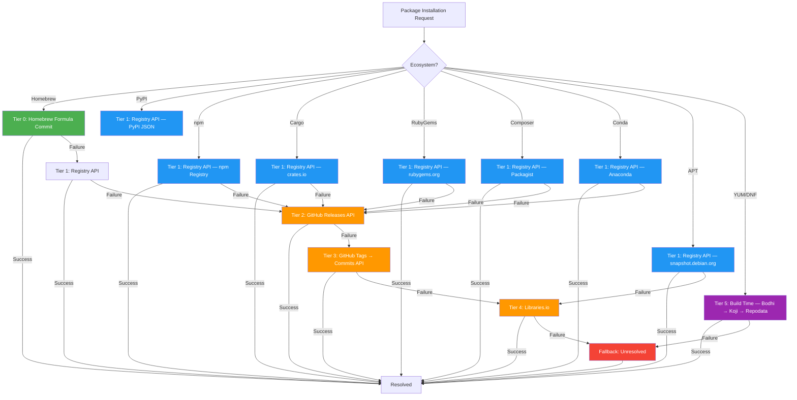
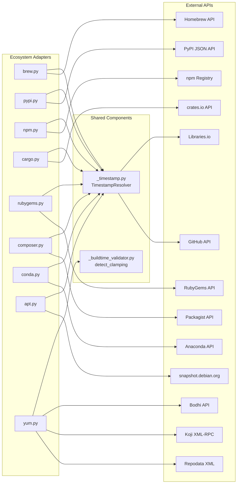
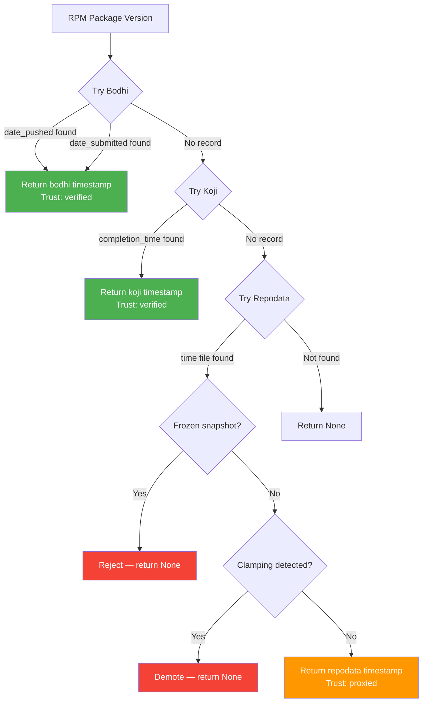

# Timestamp Resolution

This document describes how pkg-defender resolves publication timestamps for
packages across different ecosystems.

## Overview

Timestamp resolution determines when a package version was published. This
information is used for cooldown checks — a security feature that blocks
recently-published packages for a configurable period (default: 7 days).

The resolver implements a **tiered fallback chain**: each tier is attempted
in order, and the first successful resolution wins. If all tiers fail, the
package receives an `"unresolved"` source label with `"unknown"` trust level.

### Full Tiered Fallback Chain



### Architecture



## Resolution Tiers

### Tier 0: Homebrew Formula Commit (Homebrew only)

For Homebrew packages, the tool resolves publication timestamps using the
formula file's commit history in `homebrew-core`. This is the most reliable
source for Homebrew because:

1. Every Homebrew formula has a corresponding file in `homebrew-core`.
2. The commit date reflects when the formula was last updated (typically a
   version bump).
3. The data comes from Homebrew's own infrastructure — no third-party
   dependencies.

**Source label:** `"homebrew_formula_commit"`
**Trust level:** `"verified"` (30-day cache)
**Cache TTL:** 30 days

**Resolution flow:**

1. Fetch formula metadata from `https://formulae.brew.sh/api/formula/{name}.json`
2. Extract `ruby_source_path` (e.g., `"Formula/a/aview.rb"`) and `tap` (e.g., `"homebrew/core"`)
3. Validate `tap` against whitelist: only `homebrew/core` and `homebrew/cask` are allowed
4. Query `GET https://api.github.com/repos/Homebrew/homebrew-core/commits?path={ruby_source_path}&per_page=1`
5. Parse `commit.committer.date` from the response

**Feature flag:** `enable_homebrew_formula_commit` in `PKGDConfig`. Defaults
to `True`. Set to `False` in `pkgd.toml` or via
`PKGD_ENABLE_HOMEBREW_FORMULA_COMMIT=false` to disable.

**Fallback:** If the Homebrew formula commit resolution fails (missing fields,
API error, unknown tap), the tool falls through to Tier 1.

---

### Tier 1: Registry API

Each ecosystem adapter queries its native registry API for per-version publish
timestamps. This is the most authoritative source for ecosystems that expose
this data directly.

**Source label:** `"registry_api"`
**Trust level:** `"verified"` (30-day cache)
**Cache TTL:** 30 days

**Ecosystems and endpoints:**

| Ecosystem | API Endpoint                                      | Timestamp Field                |
| --------- | ------------------------------------------------- | ------------------------------ |
| PyPI      | `GET /pypi/{name}/{version}/json`                 | `urls[0].upload_time_iso_8601` |
| npm       | `GET /{encoded_name}`                             | `time[version]`                |
| Cargo     | `GET /api/v1/crates/{name}/versions`              | `versions[].created_at`        |
| RubyGems  | `GET /api/v1/versions/{name}.json`                | `versions[].created_at`        |
| Composer  | `GET /packages/{vendor}/{name}.json`              | `versions[ver].time`           |
| Conda     | `GET /package/conda-forge/{name}`                 | `files[].upload_time`          |
| APT       | `GET /mr/binary/{name}/{ver}/binfiles?fileinfo=1` | `fileinfo.*.first_seen`        |

**Resolution flow (example: PyPI):**

1. Query `GET https://pypi.org/pypi/{package}/{version}/json`
2. Extract `urls[0].upload_time_iso_8601` from the response
3. Parse ISO 8601 datetime string
4. Return `(datetime, "registry_api")`

**Resolution flow (example: npm):**

1. Query `GET https://registry.npmjs.org/{encoded_package}`
2. Extract `time[version]` from the response
3. Parse ISO 8601 datetime string
4. Return `(datetime, "registry_api")`

**Resolution flow (example: Cargo):**

1. Query `GET https://crates.io/api/v1/crates/{package}/versions`
2. Find entry where `num == version`
3. Extract `created_at` from the matching entry
4. Parse ISO 8601 datetime string
5. Return `(datetime, "registry_api")`

**Resolution flow (example: Composer):**

1. Parse vendor/package format (e.g., `"laravel/framework"` → `("laravel", "framework")`)
2. Query `GET https://packagist.org/packages/{vendor}/{name}.json`
3. Extract `versions[version].time` from the response
4. Parse ISO 8601 datetime string
5. Return `(datetime, "registry_api")`

**Resolution flow (example: Conda):**

1. Query `GET https://api.anaconda.org/package/conda-forge/{package}`
2. Filter `files[]` where `version == requested_version`
3. Extract `upload_time` from matching entries
4. Parse ISO 8601 datetime string
5. Return `(datetime, "registry_api")`

**Resolution flow (example: APT):**

1. Query `GET https://snapshot.debian.org/mr/binary/{package}/{version}/binfiles?fileinfo=1`
2. Extract `first_seen` from the first fileinfo entry
3. Parse `%Y%m%dT%H%M%SZ` timestamp format
4. Return `(datetime, "registry_api")`

**Failure modes:**

- Package not found (404)
- API rate limiting (429)
- Network timeout
- Malformed response (missing expected fields)
- Package name SSRF validation failure

**SSRF prevention:**

- Package names are validated against ecosystem-specific regexes before URL construction
- Scoped npm packages (`@scope/name`) are URL-encoded to `%40scope%2Fname`
- Composer packages are split on `/` to extract vendor and name separately

---

### Tier 2: GitHub Releases API

Queries the GitHub Releases API for the release matching the requested version.
This tier is used when the ecosystem's native registry API does not provide
per-version timestamps, or when the native API call fails.

**Source label:** `"github_releases"`
**Trust level:** `"claimed"` (7-day cache)
**Cache TTL:** 7 days

**Resolution flow:**

1. Extract `(owner, repo)` from the GitHub URL
2. Build tag variants to try: `[version, "v" + version, version.lstrip("v")]`
3. Deduplicate variants while preserving order
4. For each tag variant:
   - Query `GET https://api.github.com/repos/{owner}/{repo}/releases/tags/{tag}`
   - If response is a dict and contains `published_at`, parse and return it
5. If all tag variants fail, return `None` (fall through to Tier 3)

**Tag format handling:**

- `version` (e.g., `"1.2.3"`)
- `v{version}` (e.g., `"v1.2.3"`)
- `{version}.lstrip("v")` (e.g., `"1.2.3"` from `"v1.2.3"`)

**Failure modes:**

- GitHub URL is `None` (no GitHub repository known for this package)
- No release exists for the requested version
- All tag format variants return 404
- GitHub API rate limit exceeded (403)
- Network timeout or error

**GitHub API rate limiting:**

- Without authentication: 60 requests/hour
- With a GitHub token (`PKGD_GITHUB_TOKEN` env var or `feeds.ghsa_token` in `pkgd.toml`): 5,000 requests/hour
- Rate limit errors are cached for 5 minutes per domain to avoid wasted retries

---

### Tier 3: GitHub Tags → Commits API

Falls back to querying GitHub tags, then resolving the tag to a commit date.
This tier has near-100% success for any repository with tags.

**Source label:** `"github_tags"`
**Trust level:** `"claimed"` (7-day cache)
**Cache TTL:** 7 days

**Resolution flow:**

1. Extract `(owner, repo)` from the GitHub URL
2. Normalize the target version (strip `v` prefix)
3. Paginate through tags: `GET /repos/{owner}/{repo}/tags?per_page=100&page={n}`
   - Maximum 5 pages (500 tags total)
   - Stop early if a page returns fewer than 100 results
4. For each tag entry:
   - Normalize tag name (strip `v` prefix)
   - Match against target version using `_match_tag_to_version()`
   - If match found, extract `commit.sha`
5. Query `GET /repos/{owner}/{repo}/commits/{sha}`
6. Extract `commit.committer.date` from the response
7. Parse ISO 8601 datetime string

**Tag matching logic (`_match_tag_to_version`):**

- Exact match after normalization (stripping `v` prefix)
- Trailing `.0` differences are tolerated (e.g., `"v2.31.0"` matches `"2.31"`)
- Both tag and target are normalized before comparison

**Failure modes:**

- GitHub URL is `None` (no GitHub repository known)
- No tags match the requested version (searched 500 tags)
- Tag exists but has no `commit.sha`
- Commit date cannot be parsed
- GitHub API rate limit exceeded (403)
- Network timeout or error

---

### Tier 4: Libraries.io

Third-party fallback using the Libraries.io API. Queries per-version publish
timestamps from a centralized index of package registries.

**Source label:** `"libraries_io"`
**Trust level:** `"claimed"` (7-day cache)
**Cache TTL:** 7 days

**Supported platforms:**

| Internal Ecosystem | Libraries.io Platform |
| ------------------ | --------------------- |
| `pypi`             | `pypi`                |
| `npm`              | `npm`                 |
| `rubygems`         | `rubygems`            |
| `cargo`            | `cargo`               |
| `homebrew`         | `homebrew`            |
| `conda`            | `conda`               |

**Not supported:** Packagist (Composer), APT (Debian), YUM/DNF (RPM).

**Resolution flow:**

1. Map internal ecosystem name to Libraries.io platform name
2. Query `GET https://libraries.io/api/{platform}/{package}`
3. If `PKGD_LIBRARIES_IO_KEY` is set, append `?api_key={key}` for higher rate limits
4. Iterate `versions[]` array, looking for entry where `number == version`
5. Extract `published_at` from the matching entry
6. Parse ISO 8601 datetime string

**Failure modes:**

- Ecosystem not in `LIBRARIES_IO_PLATFORM_MAP` (e.g., Packagist)
- Package not found on Libraries.io
- Version not found in the versions list
- API rate limit exceeded
- Network timeout or error

**API key:** Set `PKGD_LIBRARIES_IO_KEY` environment variable or configure
`libraries_io_key` in `pkgd.toml` for higher rate limits. Without an API key,
Libraries.io still works but with lower rate limits.

---

### Tier 5: Build Time (RPM Cascade)

RPM-based ecosystems (YUM, DNF) use a specialized three-source cascade for
timestamp resolution. This cascade is used because RPM registries do not
provide per-version publish timestamps through a single API — instead,
timestamps are spread across multiple systems (Bodhi, Koji, and repodata).

**Source labels:** `"bodhi"`, `"koji"`, `"repodata"`
**Trust levels:** `"verified"` (Bodhi, Koji), `"proxied"` (repodata)
**Cache TTL:** 30 days (verified), 7 days (proxied)

**Resolution flow:**



#### Sub-tier: Bodhi (Fedora Updates System)

Queries the Bodhi REST API for Fedora/EPEL package update information.
Returns `date_pushed` when populated (canonical "last push event" — to
testing or stable), falling back to `date_submitted` (first submission
to Bodhi).

**Source label:** `"bodhi"`
**Trust level:** `"verified"`
**API endpoint:** `GET https://bodhi.fedoraproject.org/updates/?packages={name}&releases={version}`
**Cache TTL:** 6 hours

**Resolution flow:**

1. Query Bodhi REST API for updates matching the package NVR
2. If `date_pushed` is available, use it (preferred)
3. If only `date_submitted` is available, use it (fallback)
4. If no record exists, fall through to Koji

**Failure modes:**

- Package is not in Bodhi (not a Fedora/EPEL package)
- API returns no matching updates
- Anubis PoW challenge blocks access (designed to work without doc access)

#### Sub-tier: Koji (Build System)

Queries the Koji XML-RPC API for build completion time. Used as a tiebreaker
when Bodhi has no record. `getBuild(nvr)` returns a struct with
`completion_time` — the wall-clock when the Koji build task completed.

**Source label:** `"koji"`
**Trust level:** `"verified"` (but build time, not push time — ~1-2 minutes
accuracy vs. Bodhi's `date_pushed`)
**API endpoint:** XML-RPC `getBuild(nvr)` on `https://koji.fedoraproject.org/kojihub`
**Timeout:** 30 seconds

**Resolution flow:**

1. Construct NVR (Name-Version-Release) string
2. Call `getBuild(nvr)` via XML-RPC POST
3. Extract `completion_time` from the response struct
4. If found, return the timestamp
5. If no record exists, fall through to repodata

**Failure modes:**

- Package not found in Koji
- XML-RPC fault response
- Network timeout
- Malformed XML response

#### Sub-tier: Repodata (Universal RPM Fallback)

Queries YUM/DNF repodata metadata across 11 verified RPM distributions.
Extracts the `<time file>` value from the repodata XML as a proxied
timestamp.

**Source label:** `"repodata"`
**Trust level:** `"proxied"` (not a verified publish timestamp — accurate
to minutes for fresh packages, accurate to weeks/months for frozen-snapshot repos)
**Cache TTL:** 7 days

**Supported distributions (11 verified):**

| Distribution          | Repodata URL                                                                             |
| --------------------- | ---------------------------------------------------------------------------------------- |
| Fedora (rawhide)      | `https://dl.fedoraproject.org/pub/fedora/linux/development/rawhide/Everything/x86_64/os` |
| EPEL 9                | `https://dl.fedoraproject.org/pub/epel/9/Everything/x86_64`                              |
| CentOS Stream 9       | `https://mirror.stream.centos.org/9-stream/BaseOS/x86_64/os`                             |
| Rocky Linux 9         | `https://download.rockylinux.org/pub/rocky/9/BaseOS/x86_64/os`                           |
| AlmaLinux 9           | `https://repo.almalinux.org/almalinux/9/BaseOS/x86_64/os`                                |
| Oracle Linux 9        | `https://yum.oracle.com/repo/OracleLinux/OL9/baseos/latest/x86_64`                       |
| openEuler 22.03 LTS   | `https://repo.openeuler.org/openEuler-22.03-LTS/OS/x86_64`                               |
| Mageia 9              | `https://mirrors.kernel.org/mageia/distrib/9/x86_64/media/core/release`                  |
| openSUSE Tumbleweed   | `https://download.opensuse.org/tumbleweed/repo/oss`                                      |
| RPM Fusion Free (EL9) | `https://download1.rpmfusion.org/free/el/updates/9/x86_64`                               |
| Amazon Linux 2        | `https://cdn.amazonlinux.com/2/core/2.0/x86_64/...`                                      |

**Resolution flow:**

1. Walk the repodata URL list in order
2. For each URL, download and decompress `repomd.xml` → `primary.xml.gz` or `primary.xml.xz`
3. Parse XML to find the package entry matching the requested NVR
4. Extract `<time file>` value (epoch seconds)
5. Return the timestamp

**Failure modes:**

- Package not found in any repodata source
- Network timeout or error
- XML parsing failure
- Frozen-snapshot repo detected (e.g., openEuler 22.03 LTS)
- BUILDTIME clamping detected (see below)

**Frozen-snapshot rejection:**

Frozen-snapshot repos (e.g., openEuler 22.03 LTS) return the same timestamp
for every package — the repo rebuild time, not a per-package timestamp.
These are rejected outright by the cascade.

**BUILDTIME clamping detection:**

After the repodata step, the result is passed through
`_buildtime_validator.detect_clamping()`. This detects Fedora 43+'
reproducible-builds artifact: the build system pins a single timestamp to
the entire build batch (`SOURCE_DATE_EPOCH`), causing N>5 packages to share
the same BUILDTIME in the same build window.

When clamping is detected, the cascade returns `(None, "unresolved")` — a
clamped BUILDTIME is not a meaningful "publish time" for cooldown checks.

**Clamping algorithm:**

- Strict greater-than threshold: N>5 (i.e., 6+ packages with same BUILDTIME)
- Buckets are time-bounded (TTL=2 hours) and per-source
- Module-level state with `threading.Lock` for thread safety

---

### Fallback: Unresolved

If all tiers fail, the package receives an unresolved status with a
failure-category source label indicating why resolution failed.

**Source labels:** `"unresolved"`, `"all_sources_failed"`, `"no_github_url"`,
`"rate_limited"`, `"not_found"`, `"timeout"`, `"network_error"`
**Trust level:** `"unknown"` (1-day cache)
**Cache TTL:** 1 day

**Resolution status derivation (priority order):**

1. `"no_github_url"` — no repository URL was available
2. `"rate_limited"` — GitHub API returned 403 during the session
3. Last failure reason: `"not_found"`, `"timeout"`, `"network_error"`, `"server_error"`
4. `"all_sources_failed"` — fallback when no specific reason is available

**Impact on cooldown checks:**

When timestamps are unresolved, cooldown checks are effectively skipped for
that package — there is no publish time to compare against the cooldown
window. Threat intelligence checks still run normally.

---

## Source Labels

| Source Label                | Trust Level  | Cache TTL | Description                              |
| --------------------------- | ------------ | --------- | ---------------------------------------- |
| `"homebrew_formula_commit"` | `"verified"` | 30 days   | Homebrew formula file commit date        |
| `"registry_api"`            | `"verified"` | 30 days   | Ecosystem registry API (PyPI, npm, etc.) |
| `"bodhi"`                   | `"verified"` | 30 days   | Fedora Bodhi updates system              |
| `"koji"`                    | `"verified"` | 30 days   | Fedora Koji build system                 |
| `"repodata"`                | `"proxied"`  | 7 days    | YUM/DNF repodata `<time file>`           |
| `"github_releases"`         | `"claimed"`  | 7 days    | GitHub Releases API                      |
| `"github_tags"`             | `"claimed"`  | 7 days    | GitHub Tags → Commits API                |
| `"libraries_io"`            | `"claimed"`  | 7 days    | Libraries.io (third-party)               |
| `"unresolved"`              | `"unknown"`  | 1 day     | All sources failed                       |

## Trust Levels

| Trust Level  | Cache TTL | Description                      |
| ------------ | --------- | -------------------------------- |
| `"verified"` | 30 days   | First-party API, authoritative   |
| `"proxied"`  | 7 days    | Mirror/build-system, best-effort |
| `"claimed"`  | 7 days    | Third-party / self-reported      |
| `"unknown"`  | 1 day     | No source information            |

## How the Cooldown System Uses Timestamps

The cooldown system compares the resolved publish time against the current
time to determine if a package version is old enough to install.

**Cooldown check logic:**

1. Resolve the publish timestamp for the requested package version
2. If timestamp is available:
   - Calculate `age = now - publish_time`
   - If `age < cooldown_duration_days`, block installation
   - Display remaining days in the cooldown window
3. If timestamp is unavailable (`"unresolved"` or `"unknown"` trust):
   - Skip the cooldown check for this package
   - Threat intelligence checks still run
   - A warning may be emitted (ecosystem-dependent)

**Cooldown configuration:**

```toml
# pkgd.toml
[cooldown]
default_days = 7        # 7 day cooldown window
enabled = true          # set false to disable entirely
strict_mode = true      # exit non-zero when threats found during cooldown
bypass_require_reason = true
bypass_log_retention_days = 90

[cooldown.overrides]
"critical-package" = 14  # per-package override

[cooldown.per_ecosystem]
"homebrew" = 3           # per-ecosystem override
```

**Environment variable overrides:**

| Variable                              | Default | Description                              |
| ------------------------------------- | ------- | ---------------------------------------- |
| `PKGD_COOLDOWN_ENABLED`               | `true`  | Enable/disable cooldown checks           |
| `PKGD_COOLDOWN_DEFAULT_DAYS`          | `7`     | Default cooldown window in days          |
| `PKGD_COOLDOWN_STRICT_MODE`           | `true`  | Exit non-zero on threats during cooldown |
| `PKGD_COOLDOWN_BYPASS_REQUIRE_REASON` | `true`  | Require reason when bypassing            |

## SSRF Prevention

All user-supplied package names are validated against ecosystem-specific
regexes before URL construction:

| Ecosystem | Regex                                           | Example             |
| --------- | ----------------------------------------------- | ------------------- |
| Homebrew  | `^[a-zA-Z0-9._-]+(?:@[^\s]+)?$`                 | `aview`, `gcc@13`   |
| npm       | URL-encoded (`@scope/name` → `%40scope%2Fname`) | `@babel/core`       |
| Composer  | Split on `/` → `(vendor, name)`                 | `laravel/framework` |

Additional SSRF protections:

- `TimestampResolver._fetch_json()` passes the `manager` parameter to
  `fetch_json()`, enabling domain allowlist validation for every
  timestamp-resolution request (GitHub APIs, Libraries.io)
- `api.github.com` and `libraries.io` are included in the
  `REGISTRY_ALLOWLIST` for all ecosystem managers that use timestamp
  resolution
- API response fields (`ruby_source_path`, `tap`) are validated before use
  in GitHub API calls
- Tap whitelist restricts GitHub API calls to known Homebrew repositories
- GitHub URL extraction validates domain (`github.com` only)
- All HTTP requests use timeout (15-30 seconds) and retry limits

## Configuration

Timestamp resolution behavior is controlled by:

- `enable_homebrew_formula_commit` — Toggle Tier 0 (default: `True`)
- `cooldown.default_days` — How long to block after publication (default: 7)
- `cooldown.enabled` — Toggle cooldown enforcement entirely (default: `True`)
- `cooldown.strict_mode` — Exit non-zero on threats during cooldown (default: `True`)
- `cooldown.overrides` — Per-package cooldown days overrides
- `cooldown.per_ecosystem` — Per-ecosystem cooldown window overrides
- `PKGD_GITHUB_TOKEN` — GitHub PAT for higher rate limits (60 → 5,000 req/hr)
- `feeds.ghsa_token` — Token under `[feeds]` in `pkgd.toml`, used as fallback when `PKGD_GITHUB_TOKEN` is unset (same rate limit benefit)
- `PKGD_LIBRARIES_IO_KEY` — Libraries.io API key for higher rate limits

## In-Memory Caching

The `TimestampResolver` maintains two module-level caches:

- **TTL cache** (`_timestamp_cache`): 60-second TTL for resolved timestamps.
  Avoids redundant API calls for the same `(package, version)` pair within
  a short window.

- **Rate-limit cache** (`_rate_limited_domains`): 5-minute TTL after receiving
  a 403 from a domain. Prevents wasted retries against rate-limited APIs.
